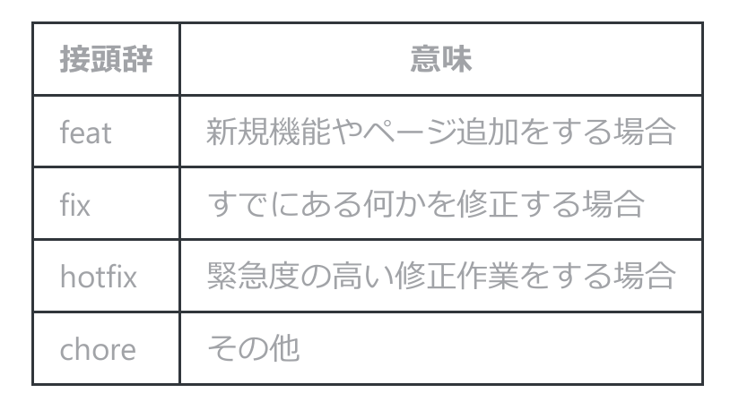
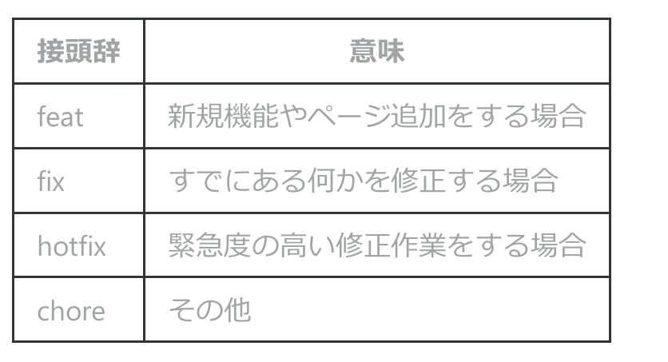
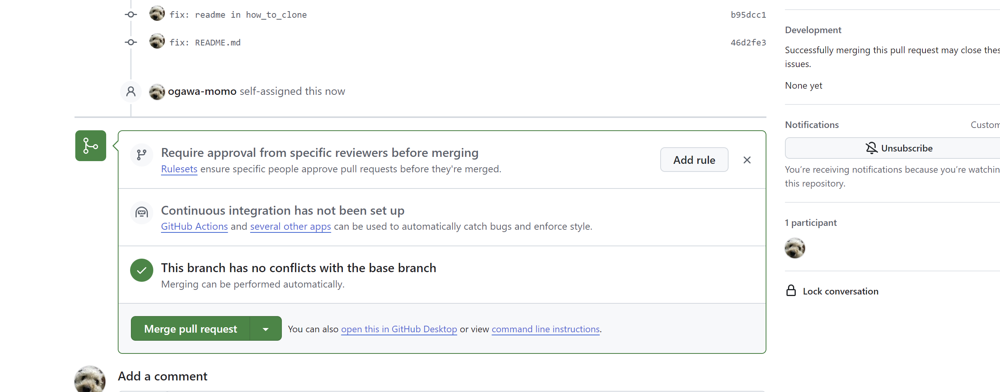

# Github の使い方
## **初めにやること**
```
cd
```
```
git clone https://github.com/ogawa-momo/alcon.git
```
無理だったらこっち
```
git clone git@momo:ogawa-momo/alcon.git
```
<br>

## 2回目の作業以降はここから
## ● Mainブランチに移動する
前に作業した者のブランチにいるかもしれないので，必ずMainブランチに移動する．ターミナルで以下のコマンドを⼊⼒する．<br>
```
git checkout main
```

## ● リモート(Github上)のMainブランチと同期する
リモートのMainブランチには本番⽤かつ最新のソースコードが保持されている．ローカルとリモートは⾃動で同期するわけではないので，作業ブランチを切る前にローカルのMainブランチにPullする．
```
git pull origin main
```

## ● 自分が作業するブランチを切る(作成する)
⾃分がローカルで作業するブランチを切る(作成する)．
ブランチの作成＋切り替えが同時にできます．
```
git checkout -b ブランチ名(名前/接頭辞+意味)
```
例 ) 構文エラーを直す 
```
$ git checkout -b ogawa/fix-syntax_error
```



## ● コーディングを行う
● 作業途中でコーディングをいったん終わる場合<br>
commitもpushもしない場合）は、必ずStashすること．<br>
未コミットの変更をスタッシュ（⼀時的に隠す）し、クリーンな状態に戻すことができる．
```
git stash -u
```
 後⽇、Stashした内容を復元する場合は以下のコマンドを⼊⼒する．
 ```
 git stash apply "stash@{0}"
 ```

{0}にはStashの番号が⼊る．git stash listでStash⼀覧を表⽰することができるので,⾃分のブランチを⾒つけて番号を指定すること．

##  ● Addする
コーディング（ファイルの変更）が終了したら，Addする．AddはGitのコマンドで，変更したファイルをステージングエリアに追加するために使⽤される．ステージングエリアは，次にコミットする変更を⼀時的に準備する場所である．コミットしたいファイルを選択してAddする．以下のコマンドを⼊⼒することで変更したすべてのファイルがAddされる．
```
git add -A
```

## Commitする
AddしたらCommitする．Commitには必ずコメントを付けてどんな変更をしたのか分かるようにしよう．
```
git commit -m "接頭辞: 作業内容"
```

例 )
```
git commit -m "fix: Typo in main.cpp"
```

## Pushする
ローカルでの作業内容（Commitしたもの）をリモート（GitHub）に送信する．以下のコマンドを⼊⼒することで，リモートにも⾃分のブランチが作成されPushすることができる．
```
git push origin 自分のブランチ名
```

## Pull Requestを作成する
pushした後に，GitHubにアクセスすると，下のような表示が出現していることが分かる．ここでは，ほかの人に何をしたかを明示的に示すと共に，ブランチの統合作業を行う．

``Add description``の欄にやったことなどを記入する．
写真挿入もできる．<br>
・ ``Reviews``をクリックして，ogawa-momoを選択 <br>
・ 欄の右側の``Assignees``の``assign yourself``をクリックして自分を追加．<br>

記述が終わったら，右下の``Create pull request``ボタンをクリックする．


## レビューを行う(小川が行うので無視して大丈夫です．)
ここでは，提出されたコードに不備がないかの二重チェックを行い，大丈夫であれば，``main``ブランチに作業ブランチを統合する．

・レビューが終了したら，``viewed``にチェックを入れる<br>
・ コードに問題が無ければ，LGTMと書いて``Approve``を選択し，Mergeする



## ブランチの削除
pushしたブランチがマージされたら，ブランチを削除する．
```
git checkout main
```
```
git branch -D 該当ブランチ
```
例)
``
git branch -D ogawa/fix_README.md
``